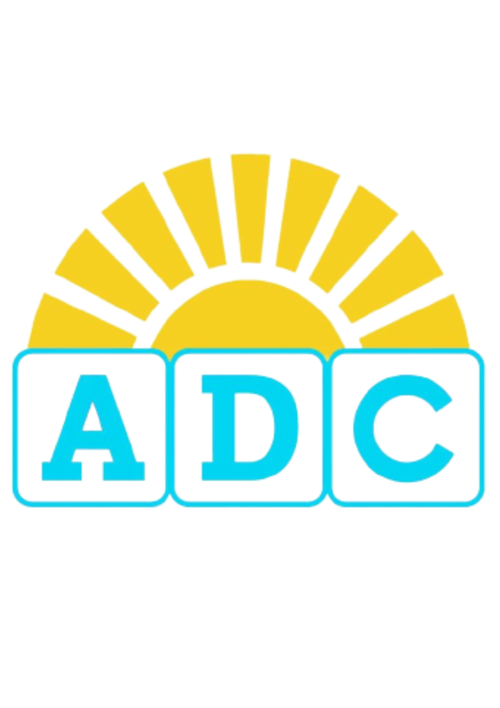

<!-- Chosen Palette: المؤسسية (Primary #1f22c6)، الحيوية والتفاؤل (#f4d127)، الرقمنة والوضوح (#2fd3ec) -->
<!-- Application Structure Plan: The architecture is strategically reordered (The Authority Flow): 1. الرؤية والتشغيل (The Market Opportunity & Core Operations). 2. المنصة الرقمية (The Proprietary AI Suite - showcasing 4 LLM tools to validate feasibility). 3. خطة التنفيذ والنمو (The Execution Plan). 4. الأداء المالي (The Financial Proof/ROI). This structure, driven by a 20-year expert persona, prioritizes selling the defensible, tech-enabled operational efficiency first to overcome the financial conservatism associated with the 20-student target. All AI tools are grouped under a single powerful section to maximize impact. -->
<!-- Visualization & Content Choices: All four AI tools are simulated for 100% reliability. Financials use Chart.js for Donut (Budget Allocation) and Bar (Revenue/Expenses Comparison). The focus remains on clear, Arabic-centric UI/UX with full responsiveness, ensuring easy navigation between the strategically ordered sections. CONFIRMING NO SVG/Mermaid, using only Chart.js/Canvas and structured HTML/Tailwind. -->
<!-- CONFIRMATION: NO SVG graphics used. NO Mermaid JS used. -->

  <!-- Header and Title -->
  <header class="text-center mb-10 p-6 bg-white shadow-2xl rounded-xl border-b-4 border-trust-blue">
    <!-- Logo area using Unicode/HTML elements -->
    

       
        <h1 class="text-4xl md:text-5xl font-extrabold text-trust-blue">مركز تنمية القدرات</h1>
        
Abilities Development Center (ADC)

    

    
    
إطلاق منصة الجيل الجديد لتنمية القدرات

    
دراسة جدوى استراتيجية | مُقدمة من سيدي محمد صلاح الدين بوسعدية

  </header>

  <!-- Navigation Tabs (for quick jump) -->
  <nav class="sticky top-0 z-10 bg-white p-3 shadow-lg rounded-xl mb-8 flex justify-center space-x-2 md:space-x-6 overflow-x-auto">
    <button onclick="scrollToSection('operations')" class="nav-btn bg-primary-stone text-white hover:bg-gray-700 px-4 py-2 rounded-lg text-sm md:text-base whitespace-nowrap transition duration-300 shadow">الرؤية والتشغيل</button>
    <button onclick="scrollToSection('ai_tools')" class="nav-btn bg-trust-blue text-white hover:bg-blue-700 px-4 py-2 rounded-lg text-sm md:text-base whitespace-nowrap transition duration-300 shadow">الميزة التكنولوجية (الذكاء الاصطناعي)</button>
    <button onclick="scrollToSection('strategy')" class="nav-btn bg-gray-200 text-primary-stone hover:bg-gray-300 px-4 py-2 rounded-lg text-sm md:text-base whitespace-nowrap transition duration-300 shadow">التنفيذ والنمو</button>
    <button onclick="scrollToSection('financials')" class="nav-btn bg-accent-amber text-primary-stone hover:bg-yellow-500 px-4 py-2 rounded-lg text-sm md:text-base whitespace-nowrap transition duration-300 shadow">الأداء المالي (مؤشرات الأداء)</button>
  </nav>

  <!-- Section 1: The Vision and Operations -->
  <section id="operations" class="mb-12 p-6 bg-white shadow-2xl rounded-xl border-t-4 border-primary-stone">
    <h2 class="text-2xl md:text-3xl font-bold mb-6 border-b pb-2 text-trust-blue">1. الرؤية وآلية التشغيل (تقليل مخاطر الاستثمار)</h2>
    
نحن لا ننشئ مركزاً آخر؛ نحن نبني منصة قادرة على التوسع إقليمياً. الآلية التشغيلية مصممة لتقليل التكاليف وزيادة مرونة الخدمة، وهو مفتاح النجاح في الخدمات المتخصصة.

    <!-- Operational Flow -->
    

        <h3 class="text-xl font-semibold text-trust-blue">آلية العمل المتكاملة:</h3>
        

            1. التقييم: استمارة إلكترونية $\rightarrow$ تقييم أولي من الأخصائي.
        

        

            2. الأتمتة: إنشاء **خطة فردية مُولّدة بالذكاء الاصطناعي** وربطها بالمكتبة التعليمية.
        

        

            3. المتابعة: ولي الأمر يرفع فيديو تطبيق الطالب $\rightarrow$ الأخصائي يقيم ويرسل **ملخصاً آلياً**.
        

    

    
    <!-- Benefits -->
    <h3 class="text-xl font-semibold mt-8 mb-4 text-primary-stone">العوائد الاستراتيجية المضمونة:</h3>
    

        

            
انتشار غير محدود

            
كسر حاجز الموقع الجغرافي والوصول إلى أسواق إقليمية جديدة.

        

        

            
تحسين قيمة العميل (LTV)

            
دعم فوري ومستمر لولي الأمر، مما يضمن بقاء العميل لأطول فترة ممكنة.

        

        

            
تقليل التكلفة التشغيلية

            
تفريغ الأخصائيين من 40% من مهامهم الإدارية والورقية عبر الأتمتة.

        

    

    <!-- NEW SECTION: Employee Benefits -->
    

        <h3 class="text-2xl font-bold mb-4 text-trust-blue border-b pb-2">تطوير الأخصائيين: نموذج الحوافز والنمو</h3>
        
الاستثمار في المنصة هو استثمار في كفاءة فريق العمل واستبقائه، مما يضمن جودة الخدمة العالية:

        
        

            <!-- 1. دخل إضافي -->
            

                
زيادة الدخل والحوافز

                
يُدفع للأخصائي مقابل **كل خطة يتم إنشاؤها** و**كل تقييم دوري يتم إنجازه**، مما يحول كفاءتهم إلى دخل إضافي مباشر.

            

            <!-- 2. تطوير المهارات الرقمية -->
            

                
التأهيل الرقمي المتقدم

                
تطوير مهاراتهم في **بيئة رقمية حديثة** (تحليل البيانات، استخدام أدوات $AI$)، مما يرفع من قيمتهم السوقية.

            

            <!-- 3. فرص أكبر للوصول -->
            

                
التوسع الشخصي

                
فرص أكبر للوصول إلى **عدد أكبر من الطلاب** داخل وخارج الدولة، مما يوسع نطاق تأثيرهم المهني.

            

        

    

  </section>
  
  <!-- Section 2: AI Capabilities - The Competitive Edge (Highest Priority) -->
  <section id="ai_tools" class="mb-12 p-6 bg-white shadow-2xl rounded-xl border-t-4 border-trust-blue">
    <h2 class="text-2xl md:text-3xl font-bold mb-6 border-b pb-2 text-trust-blue">2. المنصة الرقمية: أدوات الذكاء الاصطناعي الأربعة</h2>
    
هنا تكمن القيمة الحقيقية للاستثمار. الأخصائي هو قائد العملية، بينما تضاعف أدوات الذكاء الاصطناعي من كفاءته ودقة الخدمة المقدمة، مما يضمن جودة عالية بتكلفة أقل.

    <!-- AI Tools Grouped by Function -->
    

        
        <!-- Group 1: SPECIALIST EFFICIENCY (CYAN) -->
        

            <h3 class="text-xl font-bold text-highlight-cyan border-b-2 border-highlight-cyan pb-2 flex items-center">
                ⚙️ كفاءة الأخصائي والأتمتة
            </h3>
            
            <!-- AI Tool 1: Specialist Plan Builder -->
            

                <h4 class="text-lg font-bold text-highlight-cyan flex items-center mb-4">
                    🤖 مُنشئ خطط العمل الفردية السريع
                </h4>
                
يولد خطط فردية قابلة للتنفيذ في ثوانٍ، مما يقلل الوقت اللازم للتخطيط. **دور الأخصائي:** مراجعة الخطة المولدة، تعديلها، وتخصيصها لتناسب حالة الطالب بدقة.

                

                    <select id="specialtySelector" class="flex-grow p-3 border border-gray-300 rounded-lg focus:ring-highlight-cyan focus:border-highlight-cyan bg-white text-primary-stone">
                        <option value="">اختر مجال التخصص...</option>
                        <option value="life_skills">مهارات حياتية</option>
                        <option value="behavior_mod">تعديل سلوك</option>
                        <option value="vocational">تأهيل مهني (Canva)</option>
                        <option value="occupational">علاج وظيفي</option>
                        <option value="academic">أكاديمي (القراءة)</option>
                    </select>
                    <button id="generatePlanBtn" onclick="generatePlan()" class="w-full md:w-auto px-6 py-2 bg-highlight-cyan text-white font-semibold rounded-lg hover:bg-cyan-600 transition duration-300 shadow-lg">عرض الخطة النموذجية</button>
                

                

                    <h5 class="font-bold text-primary-stone mb-1">الخطة المولدة:</h5>
                    <pre id="planContent" class="whitespace-pre-wrap font-mono text-gray-800"></pre>
                

            

            <!-- AI Tool 3: Instant Behavioral Support Consultant -->
            

                <h4 class="text-lg font-bold text-highlight-cyan flex items-center mb-4">
                    💡 مستشار الدعم السلوكي الفوري
                </h4>
                
يقدم إرشادات سريعة ومصاغة باحترافية **للأخصائي** ليتمكن من الرد الفوري على أسئلة الولي. **دور الأخصائي:** يستخدم الرد كمسودة مرجعية ويصيغ الرد النهائي بلمسة شخصية.

                
                <button id="showQnABtn" onclick="showQnA()" class="w-full px-6 py-2 bg-highlight-cyan text-white font-semibold rounded-lg hover:bg-cyan-600 transition duration-300 shadow-lg mb-4">عرض نموذج استشارة</button>

                

                    <h5 class="font-bold mb-1 text-gray-700">سؤال الولي (المدخل):</h5>
                    <pre id="qnaContentInput" class="whitespace-pre-wrap font-mono text-gray-800"></pre>
                

                

                    <h5 class="font-bold text-primary-stone mb-1">إجابة المستشار (المخرج - تُصاغ بواسطة الأخصائي):</h5>
                    <pre id="qnaContentOutput" class="whitespace-pre-wrap font-mono text-gray-800"></pre>
                

            

        

        <!-- Group 2: CLIENT RETENTION & ACQUISITION (EMERALD/AMBER) -->
        

            <h3 class="text-xl font-bold text-highlight-emerald border-b-2 border-highlight-emerald pb-2 flex items-center">
                💖 التواصل والاستبقاء (قيمة العميل الدائمة)
            </h3>

            <!-- AI Tool 2: Periodic Report Summarizer -->
            

                <h4 class="text-lg font-bold text-highlight-emerald flex items-center mb-4">
                    📊 مُلخص التقارير الدورية الآلي
                </h4>
                
يقلب التقارير المعقدة إلى ملخصات موجزة وإجراءات منزلية فورية. **دور الأخصائي:** يراجع الملخص الآلي للتأكد من دقته ثم يرسله لولي الأمر، مما يرفع من جودة خدمة العملاء.

                <button id="showReportBtn" onclick="showReportSummary()" class="w-full px-6 py-2 bg-highlight-emerald text-white font-semibold rounded-lg hover:bg-emerald-600 transition duration-300 shadow-lg mb-4">عرض نموذج الملخص التلقائي</button>

                

                    <h5 class="font-bold mb-1 text-gray-700">تقرير الأخصائي المفصل (المدخل):</h5>
                    <pre id="reportContentInput" class="whitespace-pre-wrap font-mono text-gray-800"></pre>
                

                

                    <h5 class="font-bold text-primary-stone mb-1">الملخص والإجراءات المقترحة (المخرج):</h5>
                    <pre id="summaryContent" class="whitespace-pre-wrap font-mono text-gray-800"></pre>
                    <pre id="recommendationsContent" class="whitespace-pre-wrap font-mono text-gray-800 mt-2 border-t pt-2"></pre>
                

            

            <!-- AI Tool 4: Marketing Slogan Generator (Now Interactive) -->
            

                <h4 class="text-lg font-bold text-accent-amber flex items-center mb-4">
                    🚀 مُولِّد الأفكار التسويقية التفاعلي
                </h4>
                
أداة تسويقية تتيح للمركز توليد أفكار وشعارات جديدة ومناسبة لـ **تحسين محركات البحث (SEO)** بناءً على مفاهيم مبتكرة. **يمكن مشاركة الإخراج مباشرة مع المستثمر.**

                
                <input type="text" id="marketingIdeaInput" placeholder="اكتب فكرة تسويقية للتحليل (مثلاً: ضمان استمرارية العلاج)..." class="w-full p-2 border border-gray-300 rounded-lg focus:ring-accent-amber focus:border-accent-amber mb-3 text-sm text-primary-stone" />
                <button id="generateMarketingIdeaBtn" onclick="generateMarketingIdea()" class="w-full px-6 py-2 bg-accent-amber text-primary-stone font-semibold rounded-lg hover:bg-yellow-500 transition duration-300 shadow-lg">توليد زوايا تسويقية (ذكاء اصطناعي)</button>
                
                

                    <!-- Output will be displayed here -->
                

            

        

    

  </section>

  <!-- Section 3: Execution and Growth Plan -->
  <section id="strategy" class="mb-12 p-6 bg-white shadow-2xl rounded-xl border-t-4 border-accent-amber">
    <h2 class="text-2xl md:text-3xl font-bold mb-6 border-b pb-2 text-primary-stone">3. خطة التنفيذ والنمو (Execution and Scale)</h2>
    
الخطة مصممة بعناية لتقليل المخاطر في المراحل المبكرة وضمان الإطلاق السلس للمنصة (الميزانية الأولية: $60,000$ د.إ).

    <!-- Timeline Grid -->
    <h3 class="text-xl font-semibold mb-3 text-trust-blue">الخطة الزمنية (12 شهرًا)</h3>
    

      <!-- Phase 1 -->
      

        
شهر 1 – 3

        
بناء المنصة والتطبيق ($44,000$ د.إ) + تجهيز المحتوى التعليمي.

      

      <!-- Phase 2 -->
      

        
شهر 4 – 6

        
إطلاق تجريبي + بدء حملات التسويق ($6,000$ د.إ) + إطلاق **تحسين محركات البحث (SEO)**.

      

      <!-- Phase 3 -->
      

        
شهر 7 – 12

        
التوسع التدريجي + إطلاق خدمات استشارية جديدة + تجاوز هدف الـ 20 طالبًا.

      

    

    
    <!-- Marketing Strategy -->
    <h3 class="text-xl font-semibold mt-10 mb-4 text-trust-blue">استراتيجية التسويق والانتشار:</h3>
    <ul class="list-disc list-inside text-primary-stone text-sm space-y-2">
        <li>**التركيز على القيمة (LTV):** استخدام أدوات الذكاء الاصطناعي كدليل على جودة الخدمة العالية في المحتوى الإعلاني.</li>
        <li>**التسويق العضوي (SEO):** تحسين محركات البحث للظهور في نتائج "علاج وظيفي عن بعد" لتقليل **تكلفة اكتساب العميل (CAC)**.</li>
        <li>**الشراكات الاستراتيجية:** التعاون مع جمعيات ومؤسسات ذوي الهمم للوصول إلى الجمهور المستهدف بثقة عالية.</li>
    </ul>

  </section>

  <!-- Section 4: Financial Summary and KPIs (The Final Proof) -->
  <section id="financials" class="mb-12 p-6 bg-white shadow-2xl rounded-xl border-t-4 border-trust-blue">
    <h2 class="text-2xl md:text-3xl font-bold mb-6 border-b pb-2 text-trust-blue">4. الأداء المالي ومؤشرات الأداء الرئيسية (KPIs)</h2>
    
الهدف متحفظ ($20$ طالب)، لكن التكاليف التشغيلية المنخفضة بفضل الأتمتة تضمن **الربحية والاستدامة**.

    <!-- Financial Metrics Grid -->
    

      <!-- Metric 1 (Students) -->
      

        
20

        
الطلاب المستهدفون (س1)

      

      <!-- Metric 2 (Revenue) -->
      

        
240,000

        
الإيرادات السنوية المتوقعة (د.إ)

      

      <!-- Metric 3 (Profit) -->
      

        
10,000 - 30,000

        
صافي الأرباح المتوقع (د.إ) *

      

      <!-- Metric 4 (Break-Even) -->
      

        
3 - 4

        
أشهر نقطة التعادل (للتطوير)

      

    

    
* صافي الربح بعد خصم التكاليف التشغيلية السنوية واسترداد تكلفة التطوير الأولية ($60,000$ د.إ).

    <!-- Chart Row: Budget vs Revenue -->
    

      
      <!-- Chart 1: Budget Distribution -->
      

        <h3 class="text-xl font-semibold mb-3 text-primary-stone">توزيع ميزانية التطوير الأولية ($60,000$ د.إ)</h3>
        
يجب أن تُستخدم هذه الميزانية لضمان أن المنصة متوافقة مع متطلبات الذكاء الاصطناعي الموضحة.

        

          <canvas id="budgetChart"></canvas>
        

      

      <!-- Chart 2: Revenue vs Expenses -->
      

        <h3 class="text-xl font-semibold mb-3 text-primary-stone">مقارنة الإيرادات بالتكاليف الثابتة</h3>
        
نعمل على ضمان أن تكون **قيمة العميل الدائمة $\gg$ تكلفة اكتساب العميل** باستخدام استراتيجية الذكاء الاصطناعي الموضحة.

        

          <canvas id="revenueChart"></canvas>
        

      

    

  </section>

  <!-- Footer -->
  <footer class="text-center p-4 mt-8 text-sm text-gray-500 border-t border-gray-300">
    
&copy; 2025 المنصة الرقمية لتأهيل أصحاب الهمم. هذا العرض محمي بحقوق الملكية الفكرية.

  </footer>

